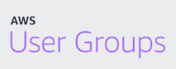

# Website Template for AWS User Groups

## Introduction
### Purpose
This is a website theme designed and built for official AWS User Groups to deploy in their domains. The project aims to encourage user groups to build their own websites, have a better online presence and maintain additional communication channels.

### Demo
visit [AWS UG Berlin website](https://aws-user-group.berlin/) to examine the latest version of the template.

### Contributors
| Name    | Contributes Since |
| -------- | ------- |
| Kadir Keles  | October 2023   |
| Aaron Walker | December 2023    |
| Jacob Moracha    | January 2024   |

*Want to contribute? Mail us with a short introduction:* kadir@berlinawsug.de

### Next Steps
* Develop responsive design
* Improve single blog page cosmetics
* Activate subscription button
* Develop forms pages
* Re-organize data sources
* Accept additional partial requests

## Installation
### Prerequisites
* [Hugo](https://gohugo.io/installation/)
* any IDE: [*](https://www.jetbrains.com/webstorm/download) [*](https://code.visualstudio.com/download) [*](https://www.vim.org/download.php) [*](https://atom-editor.cc/)
* [git](https://git-scm.com/downloads) 

### Quick Start
* clone the project to your local device: `git clone https://github.com/kkeles/awsug-hugo`
* navigate to project folder in your terminal. Test by running: `hugo server` - visit `localhost:1313` in your web browser. You should see the website up & running
* You can also use `hugo server` for development. Change content, edit templates and layout in /themes/awsug folder and follow the updates at localhost:1313 

## Usage
### Configuration & Menu Items
*Please ignore theme.toml as it's related to this project but can remain as is for your website.*
**hugo.toml** is your main configuration file:  
- baseURL: main domain you use for your website ('https://example.com').  
- languageCode: to define the language(s) of your website. Use ISO 639-1 convention ('en-us','de-at').   
- title: title of your website ('AWS User Group Brussels')  
- theme = "awsug" *please keep it as is*  
- summaryLength: number of words to appear in blog summary ('35').

<br> [menu]: define menu elements for navigation. [[menu.main]] refers to a particular menu element used, main is the identifier of the menu. In future, you can create [[menu.mobile]] or [[menu.french]] for example.  

```
  [[menu.main]]
    identifier = "about"
    name = "About"
    url = "/about/"
    weight = 20 
```
identifier is used to refer to menu item in the page. Name is the title. url is the slug. weight is used for sorting the position of your menu item.


### Content
Primarily used for blog and event pages. However, markdown (.md) files are required to call HTML files for each page. Please do not make any changes, and surely, do not delete \_index.md, about.md and, team.md files. \_index.md refers to home page of the website.

* **blog** folder is used to write blogs. Run `hugo new content blog/my-new-post.md` to create a new blog post. Alternatively, you can create a folder with preferred slug, and add index.md as a markdown file with reference files to use in the blog post.  
	* date is written in YYYY-MM-DD format. It's possible to add custom date for the post.
	* thumbnailURL is the featured image of the blog post. You can refer to an external image URL (should begin with https://) or you can add an image named as "thumbnail.png" and keep this parameter empty.
	* abstract is the summary of the post that will appear in the blogs page. Summary is limited to 35 words by default, can be extended in hugo.toml file.
	* draft = true makes the post visible. true switches the post to a draft and hides from the visitors.

* **events** folder is used to announce events. Run `hugo new content events/2024-01.md` to create a new event announcement. Alternatively, you can create a folder with preferred slug, and add index.md as a markdown file with reference files to use in the event post.
	* eventURL is the reference URL that the event is announced in external sources (Meetup.com, LinkedIn, Facebook etc.).
	* bannerURL is the featured image of the event. You can refer to an external image URL (should begin with https://) or you can add an image named as "banner.png" and keep this parameter empty.
	* Make sure eventDate is written in YYYY-MM-DD format. Events page places the object to future or past events automatically. Make sure eeventTime is written in HH:MM format.
	* eventHost refers to the company that will host the event.
	* draft = true makes the post visible. true switches the post to a draft and hides from the visitors.

### Assets
Static script files are added into this directory. By default, **css** and **js** folders are added for custom scripts. **resources** is the main reference to these assets.  
For example, if you want to run a about.css script in your page, at layouts, on top of your HTML file add the code below:  

```
{{ $css := resources.Get "css/about.css" }}
<link rel="stylesheet" href="{{ $css.RelPermalink }}" />
```
You can replace css/about.css with any other script file from this folder.  
It's also possible to refer to the file at any Hugo script, as done in the first line.

### Layouts
Main directory to add all HTML files required for each page.  

* **_default** folder is used for main templates:  
	*  **head.html, header.html** and **footer.html** files are used to define main layout of head, header and footer partials that are used in every page.  
	* **baseof.html** is used to define the main template of pages - including the reference to head, header and footer sections.  
	* **single.html** is used to define the layout of blog posts. 
* **home, about** and **team** folders are used to create layouts of each corresponding page. Bear in mind these HTML files are called in content folder within each markdown file. See /content/about.md for example:  
	`type = "2-about"`  refers to "2-about" folder in layouts.  
	`layout = "about" # name of the html file` refers to "about.html" file in the aforementioned folder.  
	
* **events** and **blog** pages are designed as list.html files, since they have dynamic content added from content folder.
* **partials** are small sections of HTML elements that can be used repetitively in your pages. For more information, please follow [Hugo documentation](https://gohugo.io/templates/partials/). For experimentation, entire home page is built with partials. It's possible to call a partial element in your page as `{{ partial "my-partial.html" .}}`  
	* action.html is used to invite your members for hosting an event or giving a speech
	* feedback.html leads to feedback page and contact form
	* landing.html is the landing part appears when the user visits the website
	* menu.html is the layout for desktop menu.
	* sponsors.html, subscribe.html are corresponding sections in the home page.
	* team-member.html is used in teams page, refers to the box including team member details.
	* terms.html is an automated document created for terms.

	
### Static
Similar to assets folder, but mainly for media files and similer types. Once deployed, the file is caught automatically in the web server. If you want to refer to date.png file located at assets/images/icons folder in your image HTML code, you should refer as follows:  
``  

Similar use can be applied for different file types as well.

> [!CAUTION] 
> Do not add ./ or absolute URL to your images. Rather, use relative permalink as shared in the example above.


## License & Contact
This project is licensed under the terms of the GNU General Public License. For additional details, see the LICENSE file included. 

If you have additional requests, questions or suggestions, feel free to contact: kadir@berlinawsug.de
