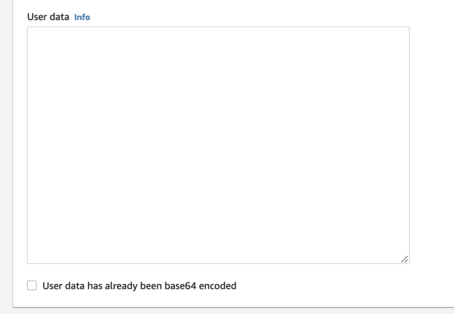
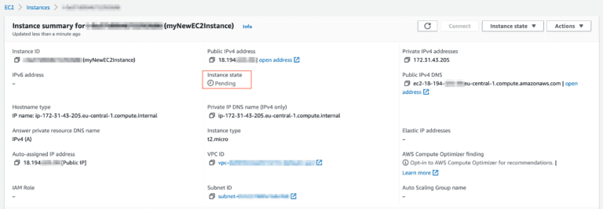

+++
title = 'Common User Data Templates for EC2'
date = 2023-05-12
thumbnailURL = ''
abstract = 'A powerful detail that will save time in repetitive creation of EC2 instances.'
author = 'Kadir Keles'
draft = false
+++

User data is worth considering while launching an EC2 instance. Any type of instance you decide to build, it will be necessary to install some supplementary software (load balancer, content management system, config tools etc.).

A manual, time-consuming method would be to connect to your instance once it’s launched, type in command line one by one, all the software that needs to be installed. User data is an alternative approach, helps you to automatically install all required software with launch of your instance. Especially in repetitive jobs, user data can save you tons of time that is easy to learn and implement.

In order to gain advantage of the user data, simply follow the steps mentioned in How To Launch an EC2 Instance? Article. The only additional step you have to take is:
- At the bottom of the page, click “Advanced details” and in the new area visible;then find user data input at the bottom of the page, to enter your user data script. 

*Once clicked, User data input field will appear at the bottom of the page*




It’s important to understand what input is given to the user data, in order to figure out what software is included and enabled with the launch of the instance.

Probably the most common script for user data will be shared below and we will elaborate the actions taken in the script line by line:

```
#!/bin/bash
yum update -y
yum install -y httpd.x86_64
systemctl start httpd.service
systemctl enable httpd.service
echo "The EC2 instance is available at $(hostname -f)" > /var/www/html/index.html
```

The first line indicates to the instance to use bash language as the command interpreter. As EC2 evolves and alternative languages are commonly used for development (Python, Ruby, C# etc.) it’s possible to define user data also in different languages. However, for the most common part, bash is a good choice and its declared at the first line.

When the new EC2 instance is launched, there are some various pre-installed packages that are included within. The second line updates these packages to their latest version, in order to make the instance compatible with following software to be downloaded.

Third line installs an Apache HTTP server on your instance. This is also known as httpd server. A common alternative to Apache HTTP server is an Nginx server. For simple projects, it’s suggested to carry on with Apache, while Nginx can be a life saver for complex projects that require high performance.

Fourth and fifth lines are a command to the system, as systemctl gives the hint. While the third line is starting the httpd server that is recently installed, fourth line is making sure that the server is constantly running. This helps to keep your instance up and running as a server, while you are making various adjustments, adding new packages and so on.

Finally on line six, we are generating an index.html file in the corresponding folder. When your EC2 instance is public, to present an interface on world-wide-web, the corresponding /html/ folder in this line is the spot to add your files. Just for a fresh and clean start, the text is added on the index.html file but once you have the page visible as below, you are free to add any html content to make your site public and alive for the whole world! 

### Sounds good! But is my EC2 Instance Web-Accessible? 
Great question! As you launch your EC2 instance, you will define your firewall settings by selecting the right security group. In order to make your EC2 instance accessible on the web, make sure it has a security group that allows an HTTP access.

Simply see the screenshot below and make sure it has a record of HTTP type, at port 80 with Anywhere (0.0.0.0/0).

*You need HTTP setting at port 80 in order to make your EC2 instance accessible on the web.*

Once you have your EC2 instance launched, it will take a few seconds to have it’s state as running. However this doesn’t indicate that your EC2 instance is launched with all conditions stated in the user data.

The best way to find this out is to check the instance summary, as in the screenshot below. When the status is pending, you still need to wait for a couple of minutes until all the changes take place. 

*It may take a few minutes for the instance to turn into "Running" state.*

As soon as your instance goes into running state, you can open the Public IPv4 address or the DNS in your browser to visit the page and see it yourself.

With different public IP address provided, you can see the areas marked in green color below.If you have any questions or comment, feel free to share below and enjoy the power of AWS that it brings with! 

